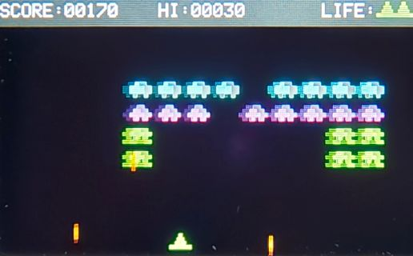
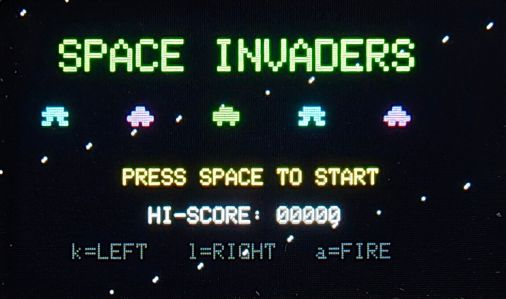
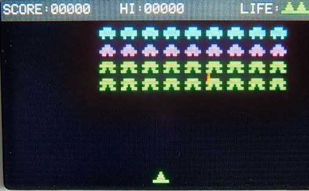

# space-invaders-cardputer
Space Invaders for M5Stack Cardputer

M5Stack Cardputer で動作するスペースインベーダーゲームです。


## 操作方法

| キー | 動作 |
|------|------|
| `k` | 左移動 |
| `l` | 右移動 |
| `a` | 弾を発射 / 画面遷移 |

## スコア

| 敵の種類 | 得点 |
|----------|------|
| 上段（青） | 30点 |
| 中段（紫） | 20点 |
| 下段（緑） | 10点 |

## 必要なライブラリ

- [M5Cardputer](https://github.com/m5stack/M5Cardputer)
- [M5GFX](https://github.com/m5stack/M5GFX)

## Screenshots





## インストール方法

1. Arduino IDE にボードを追加
   - ボードマネージャURLに以下を追加：
```
   https://m5stack.oss-cn-shenzhen.aliyuncs.com/resource/arduino/package_m5stack_index.json
```
2. ボードマネージャで `M5Stack` をインストール
3. ライブラリマネージャで `M5Cardputer` をインストール
4. `SpaceInvaders_Cardputer.ino` を開いて書き込む

## ライセンス

MIT License

Made with Claude (Anthropic)

## クレジット

Made with [Claude](https://claude.ai) (Anthropic)


